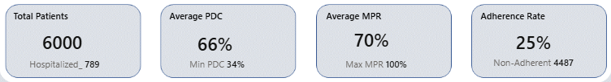
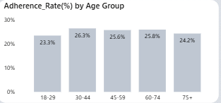
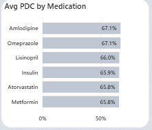
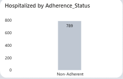

# Medication Adherence and Risk Analysis

## Background & Overview
Healthcare organizations continue to struggle with medication non-adherence, which leads to preventable hospitalizations, poor clinical outcomes, and rising operational costs. This project analyzes medication adherence behavior across 6,000 patient medication records, examining refill patterns, adherence metrics, hospitalization outcomes, and demographic differences. The dashboard evaluates adherence using Proportion of Days Covered (PDC), Medication Possession Ratio (MPR), refill gaps, and adherence classifications to identify patient populations at risk and highlight operational opportunities for improving medication continuity. The goal was to provide clinicians and care coordinators with a clear, data-driven view of adherence performance trends and hospitalization risk factors.

## Data Structure Overview
The dataset contains 6,000 observations (simulated), each representing a medication adherence record tied to a patient encounter. Demographic attributes include age group segmentation and gender distribution, while clinical features capture diagnoses, medication types, and hospitalization status. Medication utilization was measured through refill gaps, PDC, and MPR metrics, allowing adherence performance to be quantified across multiple dimensions. Time-series analysis was supported through a structured month field that enabled longitudinal trend visualizations. Derived measures were created in the model to calculate adherence rates, hospitalization rates, and adherence group classifications, enabling cross-filtering across medications, diagnoses, and patient demographics within the dashboard.

## Technical Stack
- Power BI
- DAX (Data Analysis Expressions)
- Power Query (data transformation within Power BI)

## Executive Summary
The analysis evaluated 6,000 patient medication records, identifying 789 hospitalizations, which represents an overall hospitalization rate of approximately 13%. Medication adherence was low across the population, with only 25.1% of patients classified as adherent, leaving 4,487 patients (74.78%) in the non-adherent category. Average medication coverage reached 66.3% PDC, indicating moderate medication access but insufficient adherence performance relative to typical 80% adherence benchmarks. The average MPR was 75%, with a maximum value reaching over 100%, suggesting that some patients overfilled prescriptions while others exhibited refill delays. Non-adherent patients experienced a measurable hospitalization exposure rate of approximately 17.6%, while adherent patients showed no hospitalization occurrences within this dataset, reinforcing the strong association between adherence behavior and acute care utilization.

## Insights Deep Dive
Medication adherence performance remained consistently low across demographic segments, with adherence rates ranging from 23.3% to 26.3% across age groups. Patients aged 30–44, recorded the highest adherence at 26.3%, 45-59 and 60-74 age group recoreded about 25% adherence, while the 75+ group averaged approximately 24.2%, and patients aged 18-29 recorded about 23.3% adherence. The narrow spread across age brackets indicates that adherence challenges were widespread and not concentrated within a single demographic cohort.

Diagnosis-level adherence performance demonstrated limited variation, with adherence rates ranging from 23.2% to 27.2% across conditions. This consistency suggests that adherence problems were driven more by systemic or behavioral factors rather than disease-specific treatment complexity, reinforcing the need for organization-wide adherence strategies rather than isolated clinical interventions.

Medication-level analysis revealed relatively uniform medication coverage, with average PDC values clustered between 66% and 67% across major medications. Amlodipine and Omeprazole recorded the highest average PDC values at approximately 67%, while Lisinopril averaged around 66%, demonstrating that medication availability was relatively stable despite the low adherence classification rates observed in the population.

Refill behavior presented a significant operational concern, as average refill gaps ranged between 21.8 and 22.8 days across diagnoses. Chronic Kidney Disease patients recorded the longest average refill gap at approximately 23 days, followed by Heart Disease at 22.3 days, Hypertension at 21.9 days, and Diabetes at 21.8 days. The small variation across diagnoses indicates that refill delays were a systemic issue rather than being driven by a specific clinical condition.

Hospitalization analysis highlighted adherence status as a strong utilization driver, as non-adherent patients experienced a hospitalization rate of approximately 17.6%, whereas adherent patients showed no recorded hospitalizations within this dataset. This clear separation emphasizes the potential clinical and operational value of adherence monitoring as an early risk indicator for acute care utilization.

Monthly trend analysis demonstrated relatively stable adherence performance and PDC values over time, with no significant seasonal spikes or declines observed in the dataset. Average refill gaps and adherence rates moved in parallel across months, indicating persistent adherence challenges rather than short-term fluctuations driven by external factors.

## Recommendations
Healthcare organizations should prioritize large-scale adherence improvement strategies because nearly 75% of patients fall into the non-adherent category, making population-wide interventions more impactful than disease-specific programs. Refill gap reduction programs should target the observed ~22-day average refill delay, using automated reminders, pharmacy outreach, and refill synchronization to improve medication continuity. Care coordination teams should integrate adherence status into hospitalization risk monitoring models because non-adherent patients demonstrated a 17.6% hospitalization rate, indicating a strong opportunity for early intervention. Medication monitoring programs should continue tracking adherence performance at the medication level even though average PDC values appear similar, as patient-level behavior differences remain substantial. Finally, ongoing monthly adherence monitoring should be embedded into operational dashboards to track performance improvements and evaluate the effectiveness of adherence intervention strategies over time.
